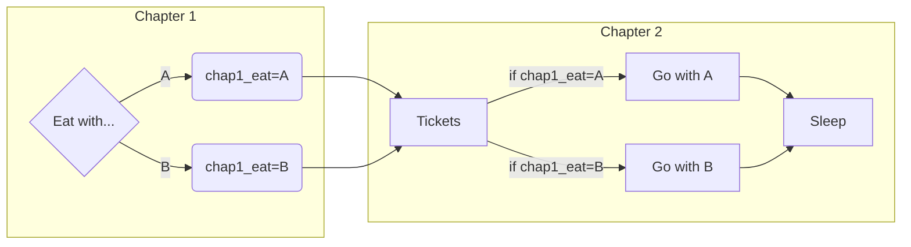
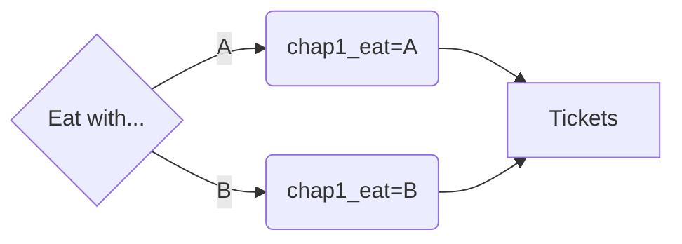
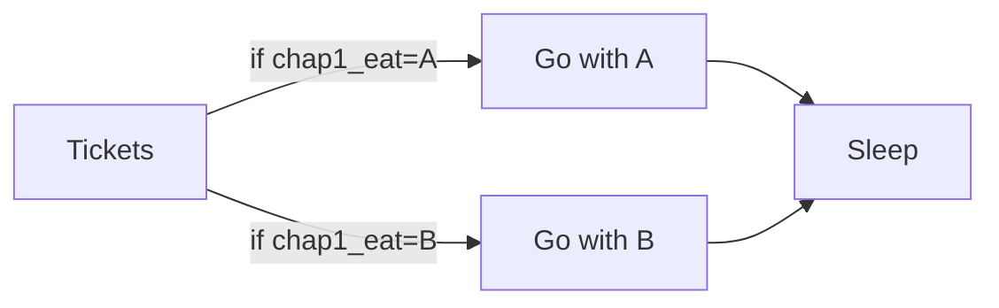
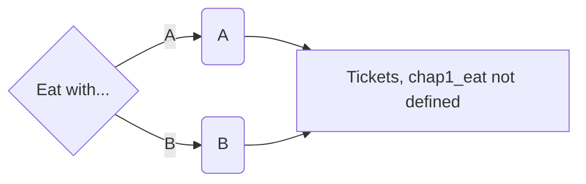
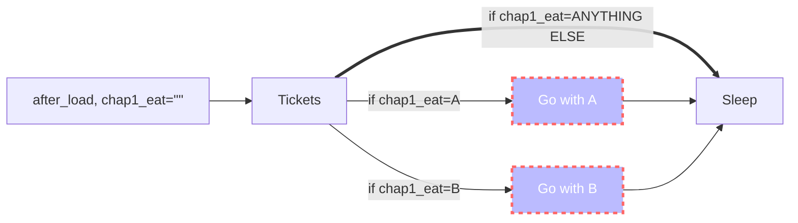

# Flags


Historical doc: [https://www.renpy.org/wiki/renpy/doc/tutorials/Remembering\_User\_Choices](https://www.renpy.org/wiki/renpy/doc/tutorials/Remembering\_User\_Choices)


### Past Builds and Flags


TL;DR: label `after_load` can repair mistakes in the past, but use carefully. Docs: [https://www.renpy.org/doc/html/label.html#special-labels](https://www.renpy.org/doc/html/label.html#special-labels)


Picture this: in your first build you start a game introducing some characters (let's call them A and B), and you add a choice menu to figure out who to eat with. "Heh, easy, let's build it right now", you say.

```renpy
menu:
    "Go with A":
        A happy "Oh, yes, I know a nice place we can go..."
    "Go with B":
        B happy "Alright that's what I'm talking about!"
```

Game gets published on Itch, all is good. And then for build 2, you decide you want to have the main character go watch a movie with someone based on whether you ate with A or with B. So then you add a new variable, `chap1_eat`, and assign it as follows:

```renpy
# Out of label
default chap1_eat = ""

# In label
menu:
    "Go with A":
        $ chap1_eat = "A"
        A happy "Oh, yes, I know a nice place we can go..."
    "Go with B":
        $ chap1_eat = "B"
        B happy "Alright that's what I'm talking about!"

# In another label in chapter 1
A "Oh, two tickets to the new movie!"
if chap1_eat == "A":
    B sad "But I guess you'll be going with A anyways."
elif chap1_eat == "B":
    B happy "Of course you're going with me, right?"
```

So now your gameflow looks a little like this:



_(I do not personally use capital letters for Character definitions, this is for clarity.)_

Nice. Now it's time to publish! Everyone's gonna love the game! ...a day later your Itch page is filled with the following screenshot:


What? Why? But I totally defined a default value for that variable! ...yes, but the variable only gets applied to a new game. All your players who tried build 1 and updated to build 2 don't have `chap1_eat` as a variable in their default store. You may think, ah fine, I can use the `after_load` label to fix this!

```renpy
label after_load:
    # fixing the eating choice error with a default value
    $ chap1_eat = ""
    return
```

You publish the game's fix, and all is good. The next day, more comments come in: "I didn't go to see the movie. I went straight to bed." What?!



Chapter 1

Chapter 2




Chapter 1 (last month or so)

Chapter 2 (today)


